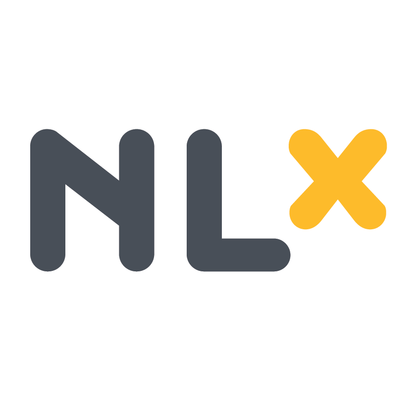

<h1></h1>

NLX is an open source inter-organisational system facilitating federated authentication, secure connecting and protocolling in a large-scale, dynamic API landscape.

This repository contains all of the components required to act out the [NLX Product Vision](https://docs.nlx.io/introduction/product-vision/).

## Developing on NLX

Please find the latest documentation for using NLX on [docs.nlx.io](https://docs.nlx.io). This is a good place to start if you would like to develop an application or service that uses or provides API access over NLX.

## Questions and contributions

Read more on how to ask questions, file bugs and contribute code and documentation in [`CONTRIBUTING.md`](CONTRIBUTING.md).

## Building and running an NLX network locally

The NLX project consists of multiple components that together make up the entire NLX platform. Some components run as centralized NLX services, others run on-premise at organizations. All components are maintained in a single repository. This means that a developer has all the tools and code to build and test the complete NLX platform in a single repository. It simplifies version and dependency management and allows changes that affect multiple components to be combined in a single feature branch and merge-request.

If you want to develop locally, or run your own NLX network, you will likely want to start all the components.

### Requirements

Make sure you have installed the following tools:

- [kubectl](https://kubernetes.io/docs/tasks/tools/install-kubectl/)
- [minikube](https://kubernetes.io/docs/tasks/tools/install-minikube/)
- [helm](https://docs.helm.sh/using_helm/)
- [skaffold](https://github.com/GoogleContainerTools/skaffold#installation)

For autocompletion and local development tasks, it's also recommended to install the following:

- [go](https://golang.org/doc/install)

This project uses the new go module feature so it is not required to setup a `GOPATH`.

### Cloning

Clone NLX in your workspace.

Note for Go developers: We advise to not clone NLX inside the GOPATH. If you must, be sure to set the environment variable `GO111MODULE=on`.
Go doesn't need to be located in the GOPATH since it uses Go module support.

```bash
git clone https://gitlab.com/commonground/nlx
cd nlx
```

### Running complete stack in kubernetes/minikube

Setup minikube on your local development machine. For developers, it's advised to setup minikube with 4 cores, 8GB RAM and 100+G storage.

e.g.: `minikube start --vm-driver=kvm2 --cpus 4 --memory 8192 --disk-size=100G`

Read the [minikube README](https://github.com/kubernetes/minikube) for more information.

Once minikube is running, initialize helm by running `helm init`.

Next, install the following dependencies:

- `traefik` for web and rest-api requests.
- `nginx-ingress` for grpc and mutual-tls connections. Latest version is currently(2018-09-06) broken, so needs `--version 0.17.1`
- `postgres` for directory-db and txlog-db.

```bash
helm install stable/traefik --name traefik --namespace traefik --values helm/traefik-values-minikube.yaml
helm install stable/nginx-ingress --name nginx-ingress --namespace=nginx-ingress --values helm/nginx-ingress-values-minikube.yaml
helm install stable/postgresql --version 0.18.1 --name postgresql --namespace=postgresql --values helm/postgresql-values-minikube.yaml
```

When these components are running, you can start all the NLX components by executing:

```bash
MINIKUBE_IP=$(minikube ip) skaffold dev --profile minikube
```

Finally, add the minikube hostnames to your machine's `/etc/hosts` file so you can reach the services from your browser.

```bash
sh initialize-hostnames.sh
```

You may now test the following sites:

- https://traefik.minikube:30443                 A webinterface showing the status of the traefik ingress controller.
- http://docs.dev.nlx.minikube:30080             The NLX docs
- http://certportal.dev.nlx.minikube:30080       The NLX certportal
- http://directory.dev.nlx.minikube:30080        The NLX directory
- http://txlog.dev.rdw.minikube:30080/           Transactionlogs for the RDW example organization
- http://txlog.dev.brp.minikube:30080/           Transactionlogs for the BRP example organization
- http://txlog.dev.haarlem.minikube:30080/       Transactionlogs for the Haarlem example organization
- http://outway.dev.haarlem.minikube:30080/      Outway in the Haarlem example organization
- http://application.dev.haarlem.minikube:30080/ Demo application

To test a full request through outway>inway, use the PostmanEcho service through the exampleorg outway: `curl http://outway.dev.exampleorg.minikube:30080/DemoProviderOrganization/PostmanEcho/get?foo1=bar1&foo2=bar2`

Note the ports; `30080` and `30443` are routed via traefik (TLS handled by traefik), whereas `:80` and `:443` are used by nginx-ingress, which does "tcp-proxying" with ssl passthrough so the mutual TLS can be handled by inway/outway/directory/etc.

If you want to connect over IP instead of using a hostname, the ingress controller cannot route the request properly. Therefore you must setup a port-forward directly to the application you want to expose. This is useful, for example, when testing IRMA using a phone on the same WiFi network as your host machine.

```bash
kubectl --namespace nlx-dev-rdw port-forward deployment/irma-api-server 2222:8080
socat tcp-listen:3333,fork tcp:127.0.0.1:2222
```

You can now let your phone connect to the IRMA api server of RDW on `your.host.machine.ip:3333`

## Troubleshooting

If you are running into other issues, please [Post an Issue on GitLab](https://gitlab.com/commonground/nlx/issues).

## Deploying and releasing

**NOTE:** Automated releases are currently not available.

The [CI system of GitLab](https://gitlab.com/commonground/nlx/pipelines) builds every push to the master branch and creates a release to Docker, tagging it with the short git commit hash.
When a release is successful, it also gets deployed to the test environment.

When a git tag is pushed, GitLab builds and deploys it to the test and staging environments.

## Live environments

There are multiple live environments for NLX

- `test`: deployed with a new version on master was build
- `acc`: deployed when a version tag (git tag) was build
- `demo`: manually deployed, only version tagged releases should be deployed to demo

## License

Copyright © VNG Realisatie 2017

[Licensed under the EUPL](LICENCE.md)
