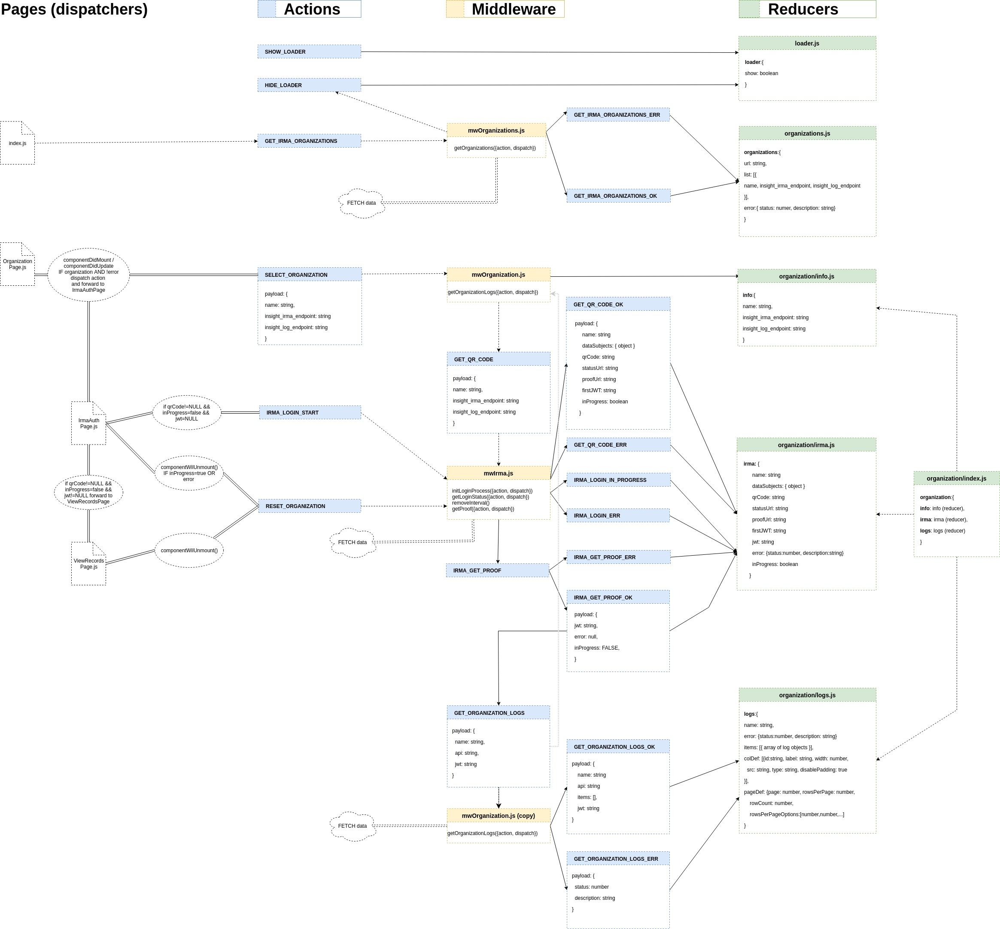

# insight-ui

The insight-ui provides a human-readable view of information exchanged between the organizations. Insight-ui uses IRMA to identify the owner of a data-subject. The communication between organizations is performed over secure NLX network.

## Development

### Proxies
Requests on `/api` are automatically proxied to http://localhost:6010. This behavior can be altered in `src/setupProxy.js`.

### Redux

All redux files are in `src/store` folder. The actions are dispatched by pages and by middleware (see picture). First action is dispatched from index.js. You can open action model (docs/redux-insight-ui.xml) using draw.io



### Project structure (folders)

- **build:** builds are placed in this folder.
- **docker:** nginx configuration file for docker build
- **docs:** developers documentation. Contains redux action model used in this readme file
- **public:** static files, like images, logos etc.
- **src:** app source code (react app)
  - `components`: generic components shared between pages
  - `layout`: main page layout component
  - `page`: page components. These usually load one or more components from components folder
  - `store`: redux store, actions, middleware and reducers
  - `styles`: CSS in JSS style definitions for all components
  - `utils`: utility functions for app and testing

### Testing locally with IRMA app

When testing IRMA using a phone on the same WiFi network as your host machine you must setup a port-forward directly to the application you want to expose.

```bash
kubectl --namespace nlx-dev-rvrd port-forward deployment/irma-api-server 2222:8080
socat tcp-listen:3333,fork tcp:127.0.0.1:2222
```

You can now let your phone connect to the IRMA api server of RvRD on `your.host.machine.ip:3333`. See comment in src/store/middleware/mwIrma.js (line 72) for detailed instruction.
